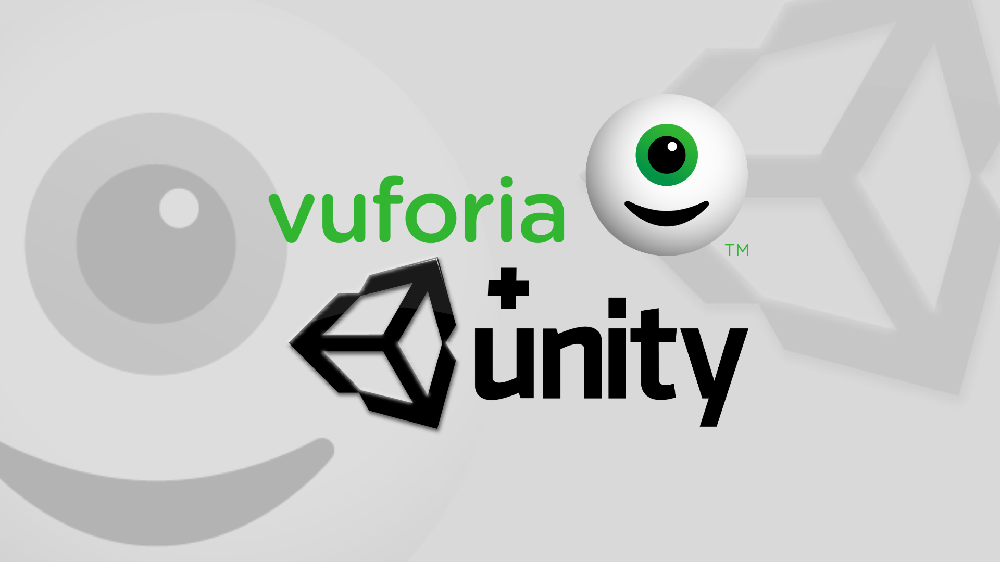
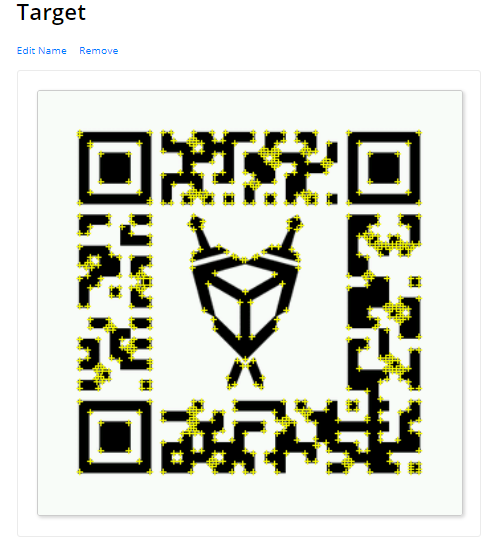
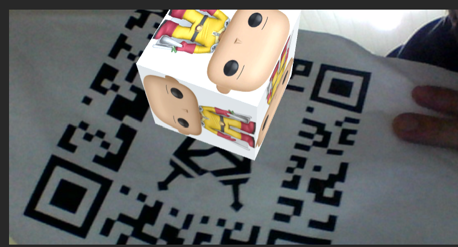
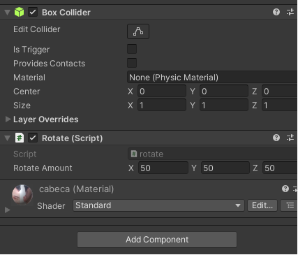

# Realidade Aumentada Unity

### Aplicação Simples de Realidade Aumentada Unity + Vuforia

<p  align="justify"> A Unity e a Vuforia oferecem uma solução robusta para o desenvolvimento de aplicativos de Realidade Aumentada (AR), possibilitando que os desenvolvedores criem experiências impressionantes de AR para diversas aplicações..
</p>

<p  align="center">
             
<br>


<p align="center">

</p>

<!--GIF-->
<p align="center">

</p>

#### Para fazer uma aplicação como esta acima basta fazer o download do Vuforia Engine:

>  O Vuforia Engine pode ser facilmente importado para o Unity

[Download Vuforia](https://developer.vuforia.com/user/login?url=/downloads/sdk%3F_%3D1678117884)


>  É necessário criar uma conta e uma licença para registrar o seu Target (alvo).
> Após isso faça o Download do seus banco de dados (target+features).

<!--Target-->
<p align="center">

</p>


<!--Target-->
<p align="center">

</p>

> A Figura acima mostra o mapeamento para realidade aumentada.

#### Monte sua cena:

> Incluindo o Imagem Target e a Câmera AR

<!--Unity-1-->
<p align="center">

</p>

#### O script para rotacionar o Cubo

```javascript
using System.Collections;
using System.Collections.Generic;
using UnityEngine;

public class rotate : MonoBehaviour
{
    public Vector3 rotateAmount;
    void Start()
    {
        
    }

    void Update()
    {
        transform.Rotate(rotateAmount * Time.deltaTime);
    }
}
```

#### Basta escolher o eixo de rotação e a módulo da posição nesse caso:
> X = 50, Y = 50, Z = 50.

<!--Detalhes-1-->
<p align="center">

</p>

> O Unity é uma plataforma de desenvolvimento de jogos que também pode ser utilizada para desenvolver aplicativos de AR.

## Feliz 2023 

